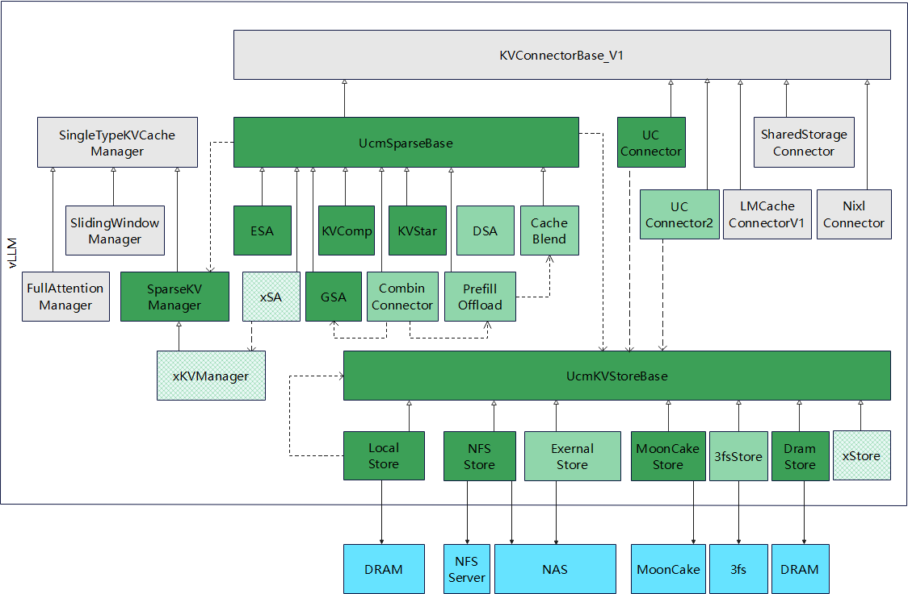
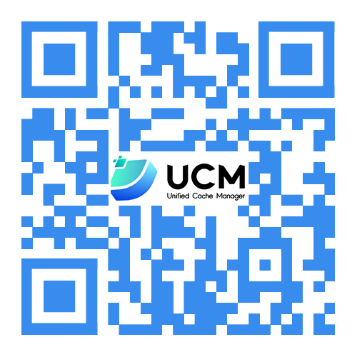

# UCM × Continuum 研究分支说明

本仓库基于 Unified Cache Management（UCM）上游代码，用于 vLLM + Continuum 联合 KV Cache 管理实验。项目针对当前 vLLM V1 代码路径完成了 KVConnector、调度器/worker 状态、DRAMStore 与原生数据传输等兼容适配，并加入成本感知 WHEN、Frontier-Tail WHAT 和 DRAM/SSD TieredStore WHERE。

主项目、部署文档和正式实验结果位于：

<https://github.com/YEYVHAIOU/vllm-prefix-experiment>

> 本仓库是研究修改分支，不是 Unified Cache Management 的官方发行版。下方“上游 UCM README”保留上游项目原始说明；其中功能范围和性能声明属于 UCM 上游项目，不代表本项目正式实验结果。

## 最终版本

```text
branch = joint-offload-v1
commit = be59181f50e515496a7f19a38178c8c2a05cf251
tag    = ucm-continuum-final-20260822
```

该提交包含正式基准测试前完成的空加载 KV Cache 初始化修正。

## 本项目主要修改

UCMConnector 已适配当前 vLLM V1 的请求、block 与 load/save 生命周期，并接收来自 vLLM/Continuum 的 GPU KV 压力、未来复用提示、上下文规模、终止状态和 Prefill / Reload 成本等运行信息。

当前完整系统的外迁决策为：

```text
WHEN  = joint + cost_full
WHAT  = frontier_tail, K=4
WHERE = TieredStore, DRAM-first / SSD-second
```

DRAMStore 补齐了当前 KVConnector 所需的 create、lookup、load、dump、wait、commit 等接口，并通过进程级共享状态兼容当前调度器/worker 运行方式。TieredStore 在 DRAM 容量不足时继续使用本地 SSD 作为外部存储。

最终版本还修正了空传输和空加载路径。空加载快速返回前会先完成实际 worker KV Cache 的发现与初始化，避免逻辑外部缓存状态与物理 KV 数据不一致。

正式 EnvBench 派生实验中，完整系统的 `cost_full` 没有选择实际 KV 外迁。因此该实验体现成本感知策略对收益不足迁移的过滤能力，不构成 Frontier-Tail / SSD 外迁独立加速的证据。完整结果见：

<https://github.com/YEYVHAIOU/vllm-prefix-experiment/blob/main/docs/BENCHMARK.md>

## 与上游 UCM 的关系

项目保留 UCM 上游的许可证与原始 README。上游 README 中提到的 Sparse Attention、PD Disaggregation、3–10× latency reduction 等内容描述的是 UCM 上游项目能力或结果。

本项目正式系统没有接入 ESA、GSA、KVStar、KVComp 等上游 Sparse Attention 算法；本项目的 Frontier-Tail 作用于外部 KV block 的部分保留，不修改 Attention 数学定义。

详细兼容修改和版本追溯见：

- <https://github.com/YEYVHAIOU/vllm-prefix-experiment/blob/main/docs/COMPATIBILITY.md>
- <https://github.com/YEYVHAIOU/vllm-prefix-experiment/blob/main/docs/SOURCE_PROVENANCE.md>

---

# 上游 UCM README

<p align="center">
  <picture>
    <source media="(prefers-color-scheme: dark)" srcset="docs/source/logos/UCM-dark.png">
    
  </picture>
</p>

<p align="center">
| <a href="https://ucm.readthedocs.io/en/latest"><b>Documentation</b></a> | <a href="https://modelengine-ai.net/#/ucm"><b>Website</b></a> | <a href="https://github.com/ModelEngine-Group/unified-cache-management/issues/78"><b>RoadMap</b></a> | <a href="README_zh.md"><b>中文</b></a> |
</p>

---

## Overview

The core principle of Unified Cache Manager (UCM) is to persist the LLM KVCache and replace redundant computations
through multiple retrieval mechanisms. UCM not only supports prefix caching but also offers a variety of training-free
sparse attention retrieval methods, delivering higher performance when handling extremely long sequence inference tasks.
Additionally, UCM provides a PD disaggregation solution based on a storage-compute separation architecture, which
enables more straightforward and flexible management of heterogeneous computing resources. When integrated with vLLM,
UCM achieves a 3-10x reduction in inference latency across various scenarios, including multi-turn dialogue and
long-context reasoning tasks.

### Motivation

With the increase of model size, the KV cache became larger and sparser, especially for long sequence requests. To
reduce the GPU memory used, offload full KV to external storage and only keep partial or compressed KV in GPU memory
became the popular direction. This can also reduce the GPU calculation, increase the sequence length and batch size of
decoding.

Sparse KV cache have many different choices. Recently paper point out that there is no common way can fit all scenarios
and all models. So better to build a common framework then different sparse algorithms can be plugin to it like KV
connector for PC.



All gray boxes in the diagram represent existing classes in vLLM version 0.9.2, while the green boxes indicate newly added components by UCM. 
The light green boxes demonstrate potential future subclass extensions based on this framework.

UcmSparseBase is the base class of different sparse algorithms. Just like KV connector design, it will hook few places of
scheduler and layer.py to do additional load, dump and calculate sparse KV blocks.

SparseKVManager allows users to define custom KV block allocations for different algorithms. 
To keep all implementations unified under the SparseKVBase framework, the system calls the SparseKVBase base class, 
while the actual implementation occurs in subclasses of sparse algorithms.

KVStoreBase helps decouple sparse algorithms from external storage. It defines methods for communicating with external storage, 
enabling any sparse algorithm to work seamlessly with any external storage system. 
The core concept here involves identifying blocks through IDs and offsets. 
This approach is not only suitable for sparse scenarios but also naturally accommodates prefix caching. 
The KVStoreConnector links it with the current KVConnectorBase_V1 to provide PC (Prefix Caching) functionality. 
For example, NFSStore serves as a reference implementation that provides the capability to store KVCache 
in either a local filesystem for single-machine scenarios or through NFS mount points in multi-server environments.

---

## Support Features

- Prefix Cache
- Cache Blend
- Model Window Extrapolation
- Prefill Offload
- Sparse Attention
- Sparse Attention Offload
- Heterogeneous PD Disaggregation

---

## Quick Start

please refer to [Quick Start](./docs/source/getting-started/quick_start.md).

---

## Branch

| **Branch** |     Status | vLLM version |
|-----------:|-----------:|-------------:|
|       main | Maintained |       v0.9.2 |
|    develop | Maintained |       v0.9.2 |

---

## Contact Us
1. For technical questions and feature requests, please use GitHub [Issues](https://github.com/ModelEngine-Group/unified-cache-management/issues).
2. WeChat technical discussion group: Scan the QR code below.



## License

UCM is licensed under the MIT with additional conditions. Please read the [LICENSE](./LICENSE) file for details.
